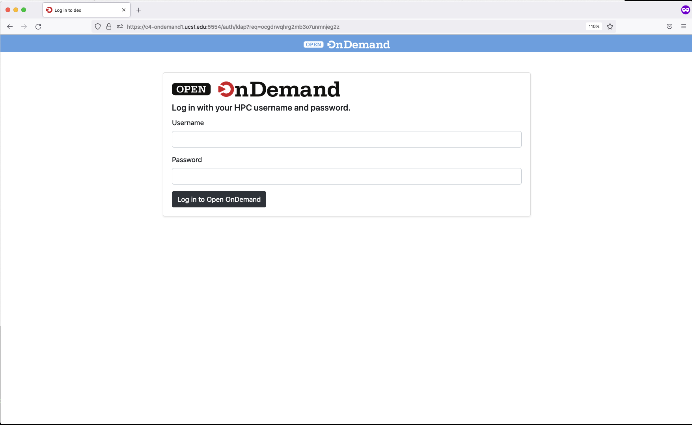
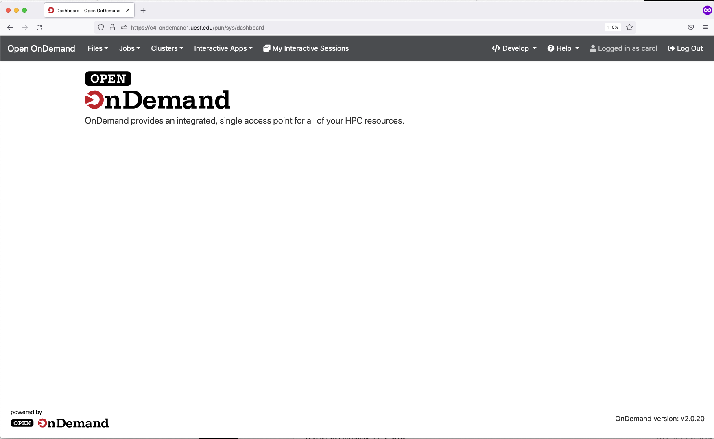

# Open OnDemand

Open OnDemand is a web based framework with easy to use GUI interfaces for common cluster taks. It's other major use is for enabling interactive software such as RStudio and Jupyter Notebooks via the same easy to use GUI interfaces.
Open OnDemand was developed at the Ohio Supercomputing Center. We have integrated this framework into C4. The primary use case for us was enabling easy to use RStudio and Jupyter based on user input. 

Additional reading:

- <a href="https://openondemand.org/">Open OnDemand</a>

## How to use OnDemand

1. As with the rest of C4, you must be on Campus or connected via UCSF IT VPN to use.

2. From your workstation, connect to OnDemand at: <a href="https://c4-ondemand1.ucsf.edu">OnDemand</a>

2. Enter your C4 username and password. Click the Login button.

### Open OnDemand Menus

From left to right:

1. The Open OnDemand link takes you to the home screen.
2. Click the Files menu