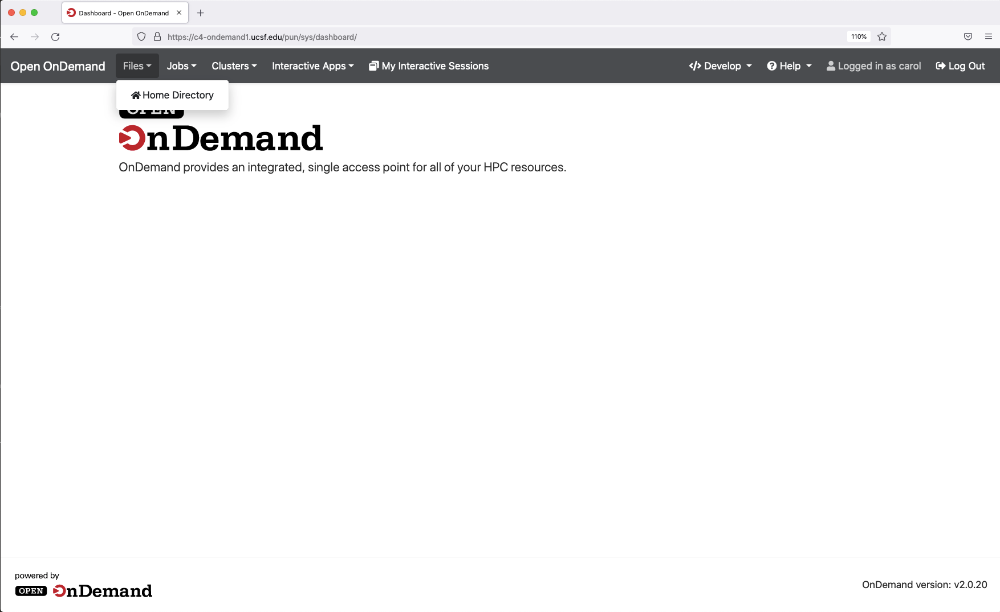

# Open OnDemand

Open OnDemand is a web based framework with easy to use GUI interfaces for common cluster taks. It's other major use is for enabling interactive software such as RStudio and Jupyter Notebooks via the same easy to use GUI interfaces.
Open OnDemand was developed at the Ohio Supercomputing Center. We have integrated this framework into C4. The primary use case for us was enabling easy to use RStudio and Jupyter based on user input. 

Additional reading:

- <a href="https://openondemand.org/">Open OnDemand</a>

## How to use OnDemand

1. As with the rest of C4, you must be on Campus or connected via UCSF IT VPN to use.

2. From your workstation, connect to OnDemand at: <a href="https://c4-ondemand1.ucsf.edu">OnDemand</a>

2. Enter your C4 username and password. Click the Login button.

### Open OnDemand Menus

From left to right:

1. The Open OnDemand link takes you to the home screen.
2. Click the Files menu 

3. Currently this is set up to access $HOME directories only. Click the Home Directory link.

4. The buttons are fairly self-explanatory here.

5. Click the Jobs link.

6. The Job Composer is untested as of this writing. Click the Active Jobs link.

7. We can see that carol had a job that just finished. This is equivalent to squeue for just your user.

8. Now the meat of the product. Click Interactive Apps.

9. We see three apps currently on offer. Click C4 Desktop.

10. This is going to launch an interactive MATE GUI Desktop on a compute node. Depending on what you are doing with the desktop you will need varying resouces. For this example, we are going to launch a MATLAB session. Field explanations:

- Number of hours is how long to run the job. Equivalent to --time
- Partition - if you have a Lab partition you can enter it here. Otherwise use common.
- Memory - number of Gigabytes you think is required.
- Number of coures - number of CPU threads you think is required.

11. Click the Launch button. Be patient here, the job may queue for a moment.

12. Click Launch C4 Desktop

13. We are greeted with a MATE desktop in a new browser tab. The easiest way to get started here is to reight click anywhere in the blue area and select Open in Terminal.

14. This is a terminal with current working directory set to $HOME/Desktop. We can load any interactive module from here. Try this `module load matlab`. Once the module loads, we can launch matlab by typing `matlab`

15. To exit cleanly and cancel the job.

  - Close the MATLAB screen.

  - Close the browser tab.

  - Click the Delete button. This is very important as it will cancel the running job and release resources for other users.

  

  - Click Confirm.

  16. For RStudio instructions see here: <a href="https://www.c4.ucsf.edu/howto/rstudio-server-2.html">RStudio Server</a>
